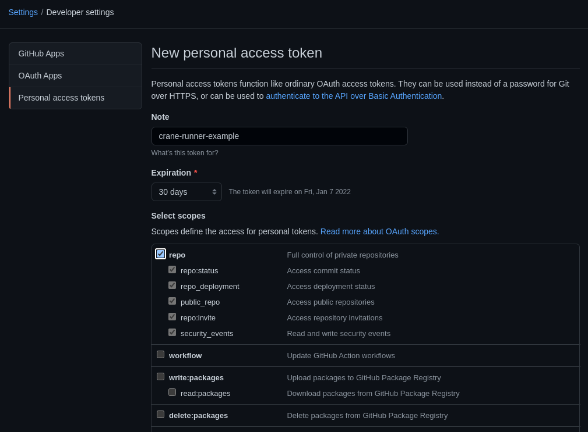
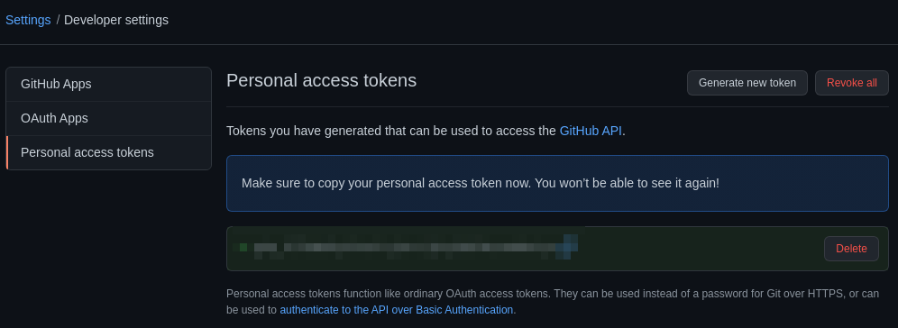

GitOps Integration
==================

This tutorial shows you how Crane Runner can be used in conjunction with
[ArgoCD](https://argo-cd.readthedocs.io/en/stable/), a GitOps continuous
delivery tool for Kubernetes, to migrate a simple stateless
[PHP Guestbook application](https://kubernetes.io/docs/tutorials/stateless-application/guestbook/).

If you just completed [Stateless Application Migration](../stateless-app-migration-with-kustomize/),
then, **be sure to** start with [Before You Begin](#before-you-begin) as you
will need to install Argo CD for this example.

# Roadmap

* Deploy Guestbook application in "source" cluster.
* Prepare for application migration.
* Export Guestbook application from "source" cluster.
* Push manifests to GitHub using ClusterTaskCreate a GitHub repository to hold our Guestbook application manifests.
* Import application using Argo CD.

# Before You Begin

You will need a "source" and "destination" Kubernetes cluster with Tekton,
the Crane Runner ClusterTasks, and Argo CD installed. Below are the steps
required for easy copy/paste:

```bash
# Start up "source" and "destination" clusters in minikube
curl -s "https://raw.githubusercontent.com/konveyor/crane/main/hack/minikube-clusters-start.sh" | bash

# Install Tekton
# See https://tekton.dev/docs/getting-started/ for help with installing Tekton
kubectl --context dest apply -f "https://storage.googleapis.com/tekton-releases/pipeline/latest/release.yaml"
kubectl --context dest --namespace tekton-pipelines wait --for=condition=ready pod --selector=app.kubernetes.io/component=controller --timeout=180s

# Install Crane Runner manifests
kustomize build github.com/konveyor/crane-runner/manifests | kubectl --context dest apply -f -

# Install Argo CD
# See https://argo-cd.readthedocs.io/en/stable/getting_started/ for help installing Argo CD
kubectl --context dest create namespace argocd
kubectl --context dest apply --namespace argocd -f https://raw.githubusercontent.com/argoproj/argo-cd/stable/manifests/install.yaml
kubectl --context dest --namespace argocd wait --for=condition=ready pod --selector=app.kubernetes.io/name=argocd-server --timeout=180s
```

# Deploy Guestbook Application in "source" Cluster

You will be deploying
[Kubernetes' stateless guestbook application](https://kubernetes.io/docs/tutorials/stateless-application/guestbook/)
modified here to be consumable via kustomize.
The guestbook application consisists of:

* redis leader deployment and service
* redis follower deployment and service
* guestbook front-end deployment and service


```bash
kubectl --context src create namespace guestbook
kustomize build github.com/konveyor/crane-runner/examples/resources/guestbook | kubectl --context src --namespace guestbook apply -f -
kubectl --context src --namespace guestbook wait --for=condition=ready pod --selector=app=guestbook --timeout=180s
```

# Prepare for Application Migration

First, create the `guestbook-gitops` namespace in the "destination" cluster
where you will migrate the guestbook application from the "source" cluster.

```bash
kubectl --context dest create namespace guestbook-gitops
```

You must upload your kubeconfig as a secret. This will be used by the
ClusterTasks to migrate the application.

```bash
kubectl config view --flatten | kubectl --context dest --namespace guestbook-gitops create secret generic kubeconfig --from-file=config=/dev/stdin
```

Next, you must ensure you have a GitHub "Personal access token". Navigate to
https://github.com/settings/tokens and select "Generate new token":


Configure and generate your personal access token:



If successful, you should now see a generated token like below:



Upload your token as a secret:

```bash
USER=${INSERT_YOUR_USERNAME}
PASS=${YOUR_GENERATED_GH_TOKEN}

cat <<EOF | kubectl --context dest --namespace guestbook-gitops apply -f -
apiVersion: v1
kind: Secret
metadata:
  name: git-credentials
  # https://tekton.dev/docs/pipelines/auth/#basic-auth-for-git
  annotations:
    tekton.dev/git-0: https://github.com
type: kubernetes.io/basic-auth
stringData:
  username: ${USER}
  password: ${PASS}
EOF
```

Create a serviceAccount and attach your secret to it:

```bash
cat <<EOF | kubectl --context dest --namespace guestbook-gitops apply -f -
apiVersion: v1
kind: ServiceAccount
metadata:
  name: guestbook-gitops-example
secrets:
  - name: git-credentials
EOF
```

Finally, after creating the `guestbook-gitops` namespace and uploading your kubeconfig and
git-credentials secrets, you need to reserve a PersistentVolume to hold the
exported manifests:

```bash
cat <<EOF | kubectl --context dest --namespace guestbook-gitops create -f -
apiVersion: v1
kind: PersistentVolumeClaim
metadata:
  name: guestbook-gitops-example
spec:
  accessModes:
  - ReadWriteOnce
  resources:
    requests:
      storage: 10Mi
EOF
```

# Export Guestbook Application from "source" Cluster

Create Tekton PipelineRun that goes through the crane workflow `export`,
`transform`, and `apply` before creating a Kustomize base from the resulting
resources.

Notice in the [PipelineRun](./pipelinerun.yaml), that the `shared-data`
workspace is referencing the `guestbook-gitops-example` PVC created earlier.
This is important as it's where the Kustomize manifests will be stored.

```bash
kubectl --context dest --namespace guestbook-gitops create -f "https://raw.githubusercontent.com/konveyor/crane-runner/main/examples/gitops-integration/pipelinerun.yaml"
```

Keep an eye on pipeline progress via:

```bash
watch kubectl --context dest --namespace guestbook-gitops get pipelineruns,taskruns,pods
```

At this stage, the Guestbook application's manifests should be safely stored in
the `guestbook-gitops-example` volume created earlier.

# Push Manifests to GitHub

Now you want to push your Kustomize manifests to GitHub. Before you do that, you
must create a GitHub repo to hold your Guestbook application manifests.
Name it whatever you would like, ie `crane-guestbook-gitops`, and then create a
TaskRun that uploads the manifests.

```bash
GIT_REMOTE_URL="https://github.com/${__YOUR_GITHUB_ID__}/crane-guestbook-gitops.git"
GIT_USER_NAME="${__YOUR_GIT_USERNAME__}"
GIT_USER_EMAIL="${__YOUR_GIT_EMAIL__}"

cat <<EOF | kubectl --context dest --namespace guestbook-gitops create -f -
apiVersion: tekton.dev/v1beta1
kind: TaskRun
metadata:
  generateName: guestbook-gitops-example-git-push-
spec:
  serviceAccountName: guestbook-gitops-example
  taskRef:
    name: git-init-push
    kind: ClusterTask
  params:
  - name: git-remote-url
    value: ${GIT_REMOTE_URL}
  - name: user-name
    value: ${GIT_USER_NAME}
  - name: user-email
    value: ${GIT_USER_EMAIL}
  workspaces:
  - name: uninitialized-git-repo
    persistentVolumeClaim:
      claimName: guestbook-gitops-example
    subPath: kustomize
EOF
```

# Import Guestbook Application into Argo CD

All you need to do now is tell Argo CD about your application, where the source
can be found, and where to install it.

```bash
cat <<EOF | kubectl --context dest --namespace argocd apply -f -
apiVersion: argoproj.io/v1alpha1
kind: Application
metadata:
  name: guestbook-gitops
spec:
  source:
    path: .
    repoURL: ${GIT_REMOTE_URL}
    targetRevision: master
  destination:
    namespace: guestbook-gitops
    server: https://kubernetes.default.svc
  project: default
  syncPolicy:
    automated:
      prune: true
      selfHeal: true
EOF
```

**NOTE** The application is created in the `argocd` namespace.

Check on the Application status with:

```bash
kubectl --context dest --namespace argocd get applications guestbook-gitops -o yaml
```

# What's Next

* Check out [Stateful Application Migration](/examples/stateful-app-migration/README.md)
* Read more about [Tekton](https://tekton.dev/docs/getting-started/)
* Read more about [Crane](https://github.com/konveyor/crane)
* Read more about [Argo CD](https://argo-cd.readthedocs.io/en/stable/)

# Cleanup

```bash
kubectl --context dest --namespace argocd delete application guestbook-gitops
kubectl --context dest delete namespace guestbook-gitops
```
